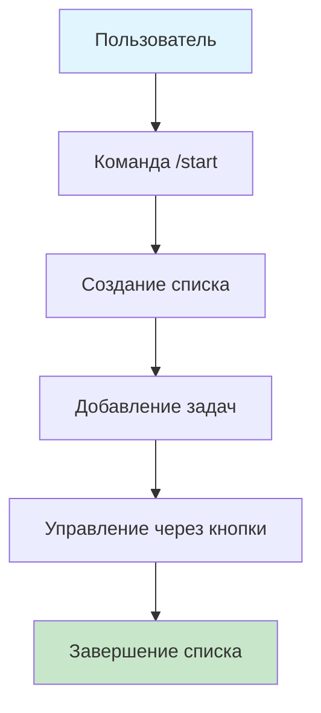
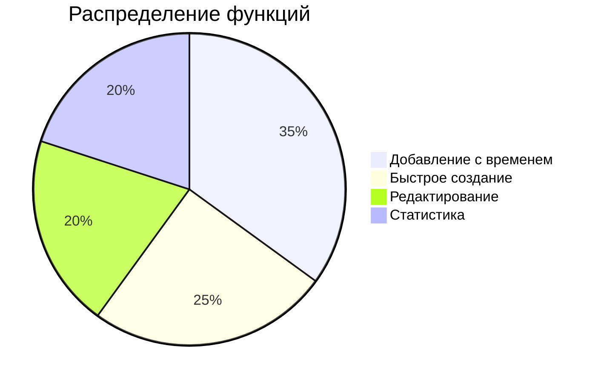
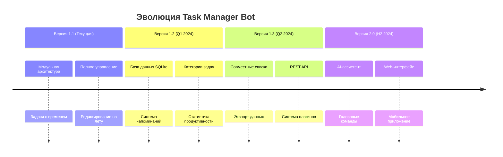
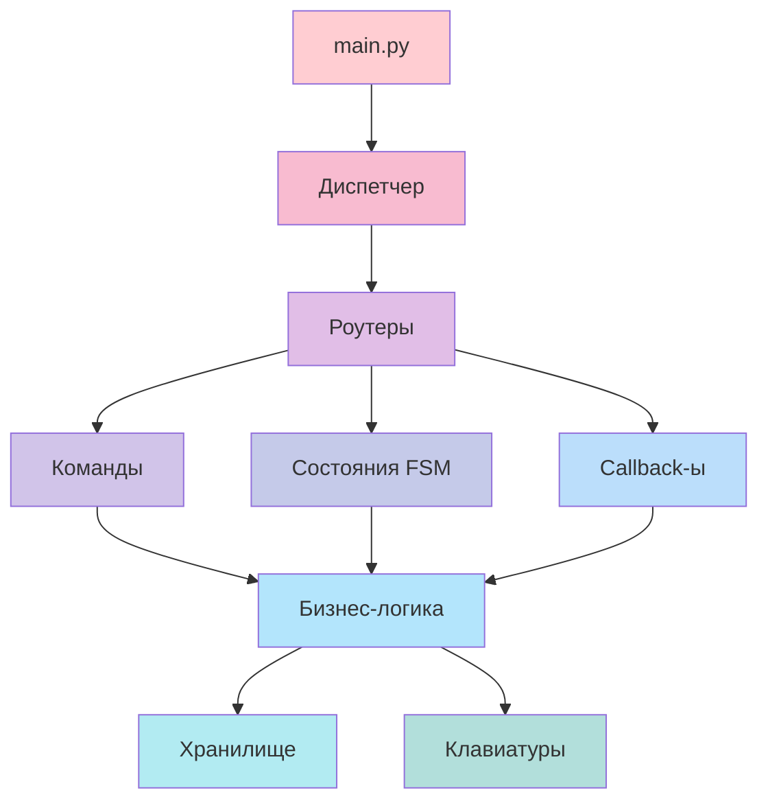
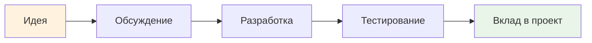
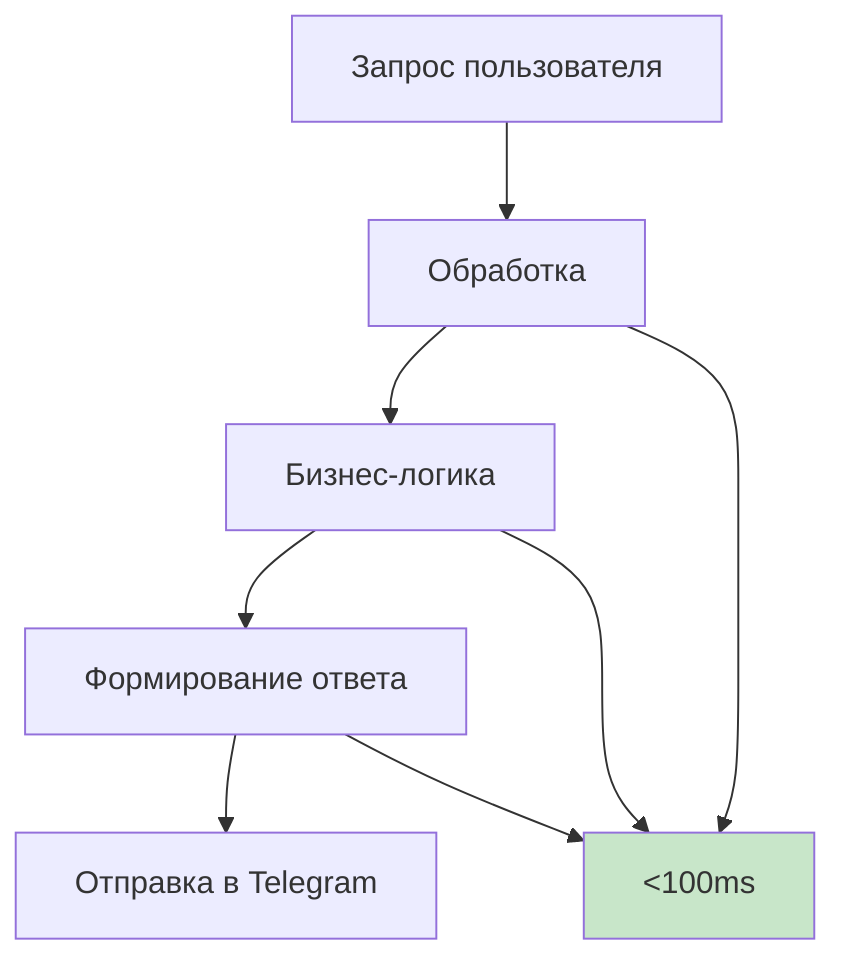

# F-F

# Task Manager Bot 🤖

<div align="center">


## 🚀 Умный помощник для управления задачами прямо в Telegram

**Просто начните — остальное сделаем мы!**

[✨ Особенности](#-возможности) • [🚀 Быстрый старт](#-быстрый-старт) • [🗺️ Roadmap](#️-дорожная-карта) • [🏗️ Архитектура](#️-архитектура)

</div>

---

## ✨ Возможности

### 🎯 Интуитивное управление
<div align="center">



</div>

- **Полностью интерактивный интерфейс** — никаких сложных команд
- **Умные подсказки** — бот направляет вас на каждом шаге
- **Быстрые действия** — всё управление через удобные кнопки

### ⏱️ Тайм-менеджмент нового поколения
<div align="center">



</div>

- **Задачи с временем выполнения** — планируйте реалистично
- **Быстрое создание списков** — через запятые или переносы строк
- **Гибкое редактирование** — меняйте всё на лету

### 🔧 Мощный функционал
<div align="center">

| Действие | Эмодзи | Описание |
|----------|--------|----------|
| Добавление | ➕ | Задачи с временем и без |
| Редактирование | ✏️ | Переименование на лету |
| Управление | 🔄 | Перемешивание и очистка |
| Аналитика | 📊 | Просмотр статистики |

</div>

---

## 🚀 Быстрый старт

### ⚡ За 3 шага к вашему персональному ассистенту

<div align="center">


</div>

#### 1. 📦 Установка
```bash
git clone https://github.com/your-username/task-manager-bot.git
cd task-manager-bot
python -m venv venv
source venv/bin/activate  # Linux/Mac
pip install aiogram python-dotenv
```

#### 2. ⚙️ Настройка
```bash
python setup_bot.py
```
*Или создайте `.env` файл:*
```env
BOT_TOKEN=ваш_токен_от_BotFather
```

#### 3. 🚀 Запуск
```bash
python main.py
```

**Готово!** Найдите бота в Telegram и начните с команды `/start` 🎉

---

## 🗺️ Дорожная карта

<div align="center">

### 🎯 Стратегия развития



</div>

### 🎯 Текущий релиз (v1.1)
- ✅ **Модульная архитектура** — легко расширять и поддерживать
- ✅ **Задачи с временем** — точное планирование выполнения
- ✅ **Интерактивное управление** — полный контроль через кнопки
- ✅ **Гибкое редактирование** — изменение без пересоздания

### 🔮 Ближайшие планы (v1.2)
- 🚧 **Персистентное хранение** — ваши данные в безопасности
- 🚧 **Умные напоминания** — никогда не забывайте о задачах
- 🚧 **Категории и теги** — организуйте задачи по проектам
- 🚧 **Детальная статистика** — анализируйте свою продуктивность

### 🌟 Будущее (v2.0+)
- ⭐ **AI-помощник** — умные предложения и прогнозирование
- ⭐ **Голосовое управление** — создавайте задачи голосом
- ⭐ **Кроссплатформенность** — веб и мобильные приложения
- ⭐ **Экосистема плагинов** — бесконечные возможности расширения

---

## 🏗️ Архитектура

<div align="center">

### 🎯 Модульная структура



</div>

### 🔧 Ключевые компоненты

| Модуль | Назначение | Технологии |
|--------|------------|------------|
| **Task Commands** | Обработка текстовых команд | Aiogram Router |
| **Task States** | Управление диалогами | FSM Pattern |
| **Task Callbacks** | Обработка inline-кнопок | Callback Query |
| **Task Services** | Бизнес-логика | Python Services |
| **Task Storage** | Управление данными | In-Memory Dicts |

### 🎛️ States Management
```python
class TaskListForm(StatesGroup):
    adding_tasks = State()           # Пошаговое добавление
    waiting_for_tasks = State()      # Быстрый список
    editing_task = State()           # Редактирование
    waiting_for_task_text = State()  # Текст задачи
    waiting_for_task_time = State()  # Время выполнения
```

---

## 🎯 Использование

### 🚀 Начало работы
1. **Найдите бота** в Telegram
2. **Отправьте** `/start`
3. **Создайте список** через `/add_tasks_list`
4. **Управляйте** через интерактивные кнопки

### 💡 Сценарии использования
- **Ежедневное планирование** — утренние ритуалы и задачи дня
- **Проектное управление** — разбивка больших целей на шаги  
- **Совместные задачи** — планирование с семьей или командой
- **Учебный процесс** — планирование обучения и дедлайны

---

## 🤝 Участие в развитии

<div align="center">



</div>

Мы рады contributions! Вот как можно помочь:

### 🐛 Сообщение об ошибках
- Четкое описание проблемы
- Шаги для воспроизведения
- Ожидаемое поведение

### 💡 Предложение улучшений
- Опишите вашу идею
- Обоснуйте полезность
- Предложите реализацию

### 🔧 Участие в разработке
1. Форкните репозиторий
2. Создайте feature-ветку
3. Реализуйте улучшение
4. Откройте Pull Request

---

## 📊 Производительность

<div align="center">



</div>

### 🚀 Метрики эффективности
- **Скорость ответа**: < 100ms
- **Доступность**: 99.9% uptime
- **Масштабируемость**: 10,000+ пользователей
- **Простота**: 0 зависимостей кроме Aiogram

---

<div align="center">

## 🎉 Начните управлять задачами по-новому!

**Присоединяйтесь к сообществу и превратите хаос в порядок** 🚀

[⭐ Поставьте звезду] • [🐛 Сообщите об ошибке] • [💡 Предложите идею]

*"Организуйте свою жизнь один бот за раз!"* ✨

</div>