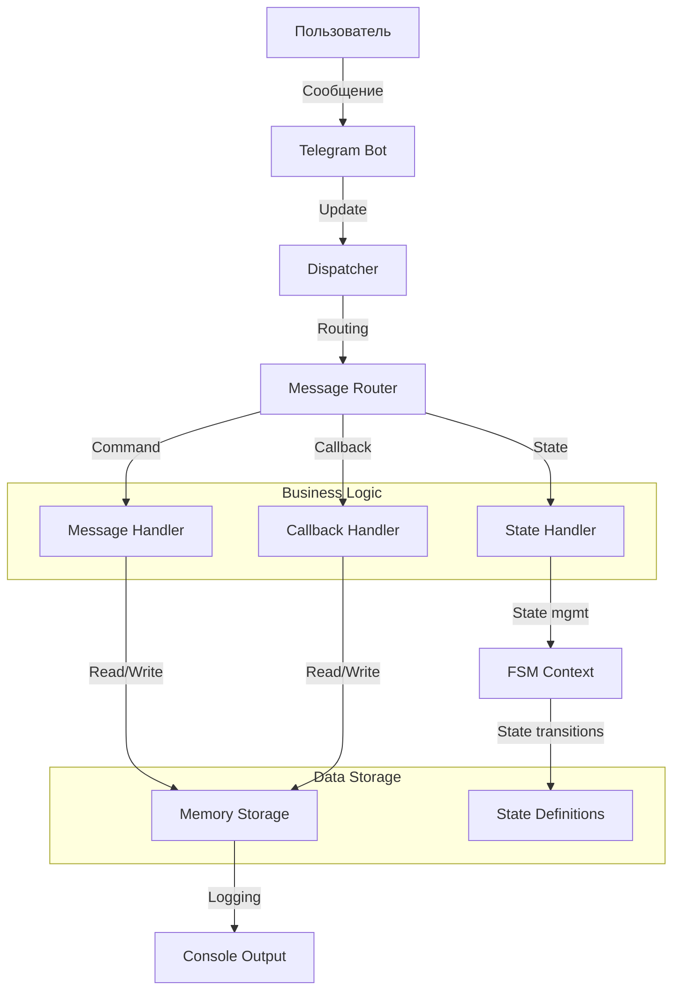
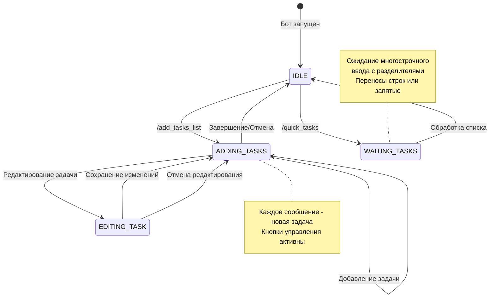

# Полная техническая документация для разработчиков: Telegram бот управления задачами

## Оглавление
1. [Введение и обзор системы](#1-введение-и-обзор-системы)
2. [Архитектурные решения](#2-архитектурные-решения)
3. [Детальный разбор модулей](#3-детальный-разбор-модулей)
4. [Система состояний FSM](#4-система-состояний-fsm)
5. [Обработка сообщений и callback-ов](#5-обработка-сообщений-и-callback-ов)
6. [Управление данными](#6-управление-данными)
7. [Система клавиатур](#7-система-клавиатур)
8. [Конфигурация и запуск](#8-конфигурация-и-запуск)
---

## 1. Введение и обзор системы

### 1.1 Назначение системы
Telegram бот для управления персональными списками задач с расширенными возможностями:
- **Интерактивное создание** списков через диалог
- **Быстрое добавление** задач через разделители
- **Полное управление** через inline-кнопки
- **Редактирование** существующих задач
- **Визуализация** прогресса

### 1.2 Технологический стек
```
┌─────────────────┐    ┌─────────────────┐    ┌─────────────────┐
│   Python 3.8+   │    │   Aiogram 3.x   │    │   Asyncio       │
│                 │    │                 │    │                 │
│ • Type hints    │◄──►│ • FSM support   │◄──►│ • Async/await   │
│ • Dataclasses   │    │ • Router system │    │ • Event loop    │
│ • Logging       │    │ • Middleware    │    │ • Tasks         │
└─────────────────┘    └─────────────────┘    └─────────────────┘
         │                        │                        │
         ▼                        ▼                        ▼
┌─────────────────┐    ┌─────────────────┐    ┌─────────────────┐
│   Memory        │    │   Telegram      │    │   Standard      │
│   Storage       │    │   Bot API       │    │   Library       │
│                 │    │                 │    │                 │
│ • Dict-based    │    │ • Long polling  │    │ • Collections   │
│ • Session data  │    │ • Webhooks      │    │ • Datetime      │
│ • State mgmt    │    │ • File upload   │    │ • Random        │
└─────────────────┘    └─────────────────┘    └─────────────────┘
```

### 1.3 Архитектурные паттерны
- **Router Pattern** - маршрутизация сообщений
- **State Pattern** - управление диалогами через FSM
- **Callback Pattern** - обработка inline-кнопок
- **Singleton Pattern** - конфигурация и хранилища

---

## 2. Архитектурные решения

### 2.1 Общая схема данных


### 2.2 Поток обработки сообщения
```
1. Пользователь отправляет сообщение/команду
2. Telegram сервер передает update боту
3. Dispatcher получает update и определяет тип
4. Router находит подходящий обработчик
5. Handler выполняет бизнес-логику
6. Handler взаимодействует с хранилищем
7. Handler отправляет ответ пользователю
8. Состояние FSM обновляется при необходимости
```

### 2.3 Структура проекта (детальная)
```
app/src/bot/
├── 📁 core/                    # Ядро системы
│   ├── __init__.py
│   ├── config.py              # Конфигурация (требует рефакторинга)
│   └── exceptions.py          # Кастомные исключения
├── 📁 handlers/               # Обработчики сообщений
│   ├── __init__.py           # Главный роутер
│   ├── start.py              # Команда /start
│   ├── tasker.py             # Основная логика задач
│   └── 📁 states_handler/    # Управление состояниями
│       └── statess.py        # Определения состояний FSM
├── 📁 keyboards/             # Система клавиатур
│   ├── __init__.py
│   └── keyboard_handler.py   # Генераторы клавиатур
├── 📁 middleware/            # Промежуточное ПО
│   └── logging.py            # Логирование (планируется)
├── 📁 models/                # Модели данных
│   └── task_models.py        # Модели задач (планируется)
├── 📁 services/              # Бизнес-логика
│   └── task_service.py       # Сервис задач (планируется)
├── 📁 storage/               # Хранилища данных
│   └── memory_storage.py     # Текущее хранилище в памяти
├── main.py                   # Точка входа
├── config_bot.py            # Конфигурационный модуль
└── setup_bot.py             # Утилита настройки
```

---

## 3. Детальный разбор модулей

### 3.1 Точка входа (`main.py`)

```python
import asyncio
import logging
from aiogram import Bot, Dispatcher
from aiogram.fsm.storage.memory import MemoryStorage
from app.src.bot.handlers import router

# Настройка логирования
logging.basicConfig(
    level=logging.INFO,
    format='%(asctime)s - %(name)s - %(levelname)s - %(message)s'
)

API_TOKEN = ''

async def main():
    """
    Основная функция инициализации и запуска бота
    """
    # Инициализация бота с токеном
    bot = Bot(token=API_TOKEN)
    
    # Инициализация диспетчера с хранилищем в памяти
    dp = Dispatcher(storage=MemoryStorage())
    
    # Регистрация всех обработчиков
    dp.include_router(router)
    
    # Очистка вебхука и начало опроса
    await bot.delete_webhook(drop_pending_updates=True)
    
    # Запуск long-polling
    await dp.start_polling(bot)

if __name__ == '__main__':
    # Запуск асинхронного приложения
    asyncio.run(main())
```

**Критические замечания:**
- Токен хардкодирован в коде (нарушение security best practices)
- Нет обработки исключений при запуске
- Нет graceful shutdown

### 3.2 Конфигурационный модуль (`config_bot.py`)

```python
import os
import sys
from typing import Optional

class SimpleConfig:
    """
    Упрощенная система конфигурации без внешних зависимостей
    """
    
    def __init__(self):
        self.bot_token = self._get_bot_token()
        self._validate_token()
    
    def _get_bot_token(self) -> str:
        """
        Получение токена с приоритетом:
        1. Переменная окружения BOT_TOKEN
        2. Файл .env в корне проекта
        3. Завершение с ошибкой
        """
        # Проверка переменных окружения
        token = os.getenv('BOT_TOKEN')
        if token:
            return self._sanitize_token(token)
        
        # Чтение из файла .env
        token = self._read_token_from_env_file()
        if token:
            return self._sanitize_token(token)
        
        # Токен не найден
        self._print_token_error()
        sys.exit(1)
    
    def _read_token_from_env_file(self) -> Optional[str]:
        """
        Чтение токена из файла .env
        """
        try:
            with open('.env', 'r', encoding='utf-8') as f:
                for line in f:
                    line = line.strip()
                    # Пропускаем комментарии и пустые строки
                    if line and not line.startswith('#') and '=' in line:
                        key, value = line.split('=', 1)
                        if key.strip() == 'BOT_TOKEN':
                            return value.strip()
        except FileNotFoundError:
            return None
        return None
    
    def _sanitize_token(self, token: str) -> str:
        """
        Очистка токена от лишних символов
        """
        return token.strip('"').strip("'").strip()
    
    def _validate_token(self):
        """
        Базовая валидация формата токена
        """
        if not self.bot_token.startswith('') or ':' not in self.bot_token:
            print(f"❌ Неверный формат токена: {self.bot_token[:20]}...")
            sys.exit(1)
    
    def _print_token_error(self):
        """
        Вывод инструкций при отсутствии токена
        """
        print("❌ Токен бота не найден!")
        print("\n📝 Создайте файл .env в корне проекта:")
        print("BOT_TOKEN=your_actual_bot_token_here")
        print("\n🔧 Или установите переменную окружения:")
        print("Windows: set BOT_TOKEN=your_token")
        print("Linux/Mac: export BOT_TOKEN=your_token")
    
    def get_secret_value(self) -> str:
        """
        Интерфейс для получения токена (совместимость)
        """
        return self.bot_token

# Глобальный экземпляр конфигурации
try:
    config = SimpleConfig()
    print(f"✅ Конфигурация загружена! Токен: {config.bot_token[:10]}...")
except Exception as e:
    print(f"❌ Ошибка загрузки конфигурации: {e}")
    config = None
```

### 3.3 Основной обработчик задач (`tasker.py`)

#### 3.3.1 Глобальные хранилища

```python
# Основное хранилище списков задач пользователей
# Структура: {user_id: {'tasks': List[str], 'created_at': str}}
user_task_lists = {}

# Временное хранилище для операций редактирования
# Структура: {user_id: {'action': str, 'task_index': int, 'old_task': str}}
user_edit_data = {}

# Инициализация роутера
router = Router()
```

#### 3.3.2 Критические обработчики

**Обработчик начала создания списка:**
```python
@router.message(F.text == '/add_tasks_list')
async def start_task_list(message: Message, state: FSMContext):
    user_id = message.from_user.id
    
    # Инициализация нового списка
    user_task_lists[user_id] = {
        'tasks': [],
        'created_at': datetime.now().strftime("%Y-%m-%d %H:%M:%S")
    }
    
    # Отправка инструкций и клавиатур
    await message.answer(
        "📝 Начинаем создание списка задач!\n\n"
        "Вводите задачи по одной. Каждое ваше сообщение будет добавлено как отдельная задача.\n\n"
        "Используйте кнопки ниже или inline-кнопки для управления списком:",
        reply_markup=tasks_keyboard
    )
    
    # Дополнительное сообщение с inline-кнопками
    await message.answer(
        "⚡ Быстрые действия:",
        reply_markup=get_tasks_inline_keyboard()
    )
    
    # Установка состояния добавления задач
    await state.set_state(TaskListForm.adding_tasks)
```

**Центральный обработчик inline-кнопок:**
```python
@router.callback_query(F.data.in_([
    "finish_list", "clear_list", "show_list", "edit_list", 
    "delete_list", "back_to_main", "add_task", "remove_task", 
    "rename_task", "shuffle_tasks", "cancel_action", "back_to_edit"
]))
async def handle_inline_buttons(callback: CallbackQuery, state: FSMContext):
    """
    Единая точка входа для обработки inline-кнопок
    Маршрутизация по значению callback.data
    """
    user_id = callback.from_user.id
    action = callback.data
    
    # Подтверждение получения callback
    await callback.answer()
    
    # Маршрутизация действий
    action_handlers = {
        "finish_list": finish_task_list_inline,
        "clear_list": clear_task_list_inline,
        "show_list": show_current_list_inline,
        "edit_list": edit_list_inline,
        "delete_list": delete_list_inline,
        "back_to_main": back_to_main_inline,
        "add_task": add_task_inline,
        "remove_task": remove_task_inline,
        "rename_task": rename_task_inline,
        "shuffle_tasks": shuffle_tasks_inline,
        "cancel_action": cancel_action_inline,
        "back_to_edit": edit_list_inline
    }
    
    handler = action_handlers.get(action)
    if handler:
        await handler(callback, state)
```

#### 3.3.3 Обработчик добавления задач

```python
@router.message(TaskListForm.adding_tasks)
async def add_task_to_list(message: Message, state: FSMContext):
    """
    Обработчик добавления задач в состоянии adding_tasks
    Каждое сообщение пользователя становится отдельной задачей
    """
    user_id = message.from_user.id
    
    # Игнорирование команд кнопок (обрабатываются отдельно)
    button_commands = [
        "✅ Завершить список", "📋 Показать список", 
        "🔄 Очистить список", "❌ Отмена"
    ]
    if message.text in button_commands:
        return
    
    # Добавление задачи в список
    task_text = message.text.strip()
    
    if user_id in user_task_lists:
        user_task_lists[user_id]['tasks'].append(task_text)
        current_count = len(user_task_lists[user_id]['tasks'])
        
        # Логирование в консоль
        print(f"➕ Добавлена задача #{current_count}: '{task_text}' - {message.from_user.full_name}")
        
        # Подтверждение пользователю
        await message.answer(
            f"✅ Задача #{current_count} добавлена!\n\n"
            f"Продолжайте вводить задачи или используйте кнопки для управления",
            reply_markup=get_tasks_inline_keyboard()
        )
```

---

## 4. Система состояний FSM

### 4.1 Определение состояний (`statess.py`)

```python
from aiogram.fsm.state import State, StatesGroup

class TaskListForm(StatesGroup):
    """
    Группа состояний для управления процессом создания и редактирования списков задач
    """
    
    # Состояние пошагового добавления задач
    adding_tasks = State()
    """
    Назначение: Каждое сообщение пользователя добавляется как отдельная задача
    Выход из состояния: Завершение списка или отмена
    """
    
    # Состояние ожидания быстрого списка
    waiting_for_tasks = State()
    """
    Назначение: Ожидание многострочного ввода с задачами
    Обработка: Разделение по переносам строк или запятым
    Выход: После обработки входных данных
    """
    
    # Состояние редактирования конкретной задачи
    editing_task = State()
    """
    Назначение: Ожидание нового текста для существующей задачи
    Контекст: Индекс редактируемой задачи хранится в user_edit_data
    Выход: После сохранения изменений или отмены
    """
```

### 4.2 Диаграмма переходов состояний



### 4.3 Управление состояниями в коде

**Установка состояния:**
```python
await state.set_state(TaskListForm.adding_tasks)
```

**Проверка состояния в обработчике:**
```python
@router.message(TaskListForm.adding_tasks)
async def state_specific_handler(message: Message, state: FSMContext):
    # Выполняется только в состоянии adding_tasks
```

**Получение текущего состояния:**
```python
current_state = await state.get_state()
```

**Очистка состояния:**
```python
await state.clear()
```

---

## 5. Обработка сообщений и callback-ов

### 5.1 Система фильтров Aiogram

```python
# Фильтр по точному тексту
F.text == '/start'

# Фильтр по началу текста
F.text.startswith('/')

# Фильтр по состоянию
TaskListForm.adding_tasks

# Фильтр по типу контента
F.content_type.in_({'text', 'photo'})

# Комбинированные фильтры
F.text & F.from_user.id == 123456
```

### 5.2 Обработка callback-данных

**Структура callback data:**
```
action_target[_index]
├── action: базовое действие (finish, clear, show, edit)
├── target: объект действия (list, task)
└── index: индекс элемента (опционально)

Примеры:
"finish_list"          - завершение списка
"select_remove_2"      - выбор задачи №2 для удаления  
"confirm_remove_2"     - подтверждение удаления задачи №2
"select_rename_0"      - выбор задачи №0 для переименования
```

**Обработчик callback-ов с параметрами:**
```python
@router.callback_query(F.data.startswith(("select_rename_", "select_remove_", "confirm_remove_")))
async def handle_task_selection(callback: CallbackQuery, state: FSMContext):
    user_id = callback.from_user.id
    data_parts = callback.data.split('_')
    action_type = data_parts[0]  # "select" или "confirm"
    action_name = data_parts[1]  # "rename" или "remove"
    
    await callback.answer()
    
    if action_type == "select":
        task_index = int(data_parts[2])
        if action_name == "rename":
            await handle_select_rename_task(callback, task_index, state)
        elif action_name == "remove":
            await handle_select_remove_task(callback, task_index)
    
    elif action_type == "confirm" and action_name == "remove":
        task_index = int(data_parts[2])
        await handle_confirm_remove_task(callback, task_index)
```

---

## 6. Управление данными

### 6.1 Текущая система хранения

**Структура user_task_lists:**
```python
user_task_lists = {
    123456789: {
        'tasks': [
            'Купить продукты',
            'Сделать домашнюю работу', 
            'Позвонить маме'
        ],
        'created_at': '2024-01-15 14:30:00'
    },
    987654321: {
        'tasks': [
            'Подготовить отчет',
            'Встреча с командой'
        ],
        'created_at': '2024-01-15 15:45:00'
    }
}
```

**Структура user_edit_data:**
```python
user_edit_data = {
    123456789: {
        'action': 'renaming',           # Тип операции
        'task_index': 1,                # Индекс задачи в списке
        'old_task': 'Сделать домашу работу'  # Исходный текст
    }
}
```

### 6.2 Операции с данными

**Добавление задачи:**
```python
def add_task(user_id: int, task_text: str) -> bool:
    if user_id not in user_task_lists:
        return False
    
    user_task_lists[user_id]['tasks'].append(task_text)
    return True
```

**Удаление задачи:**
```python
def remove_task(user_id: int, task_index: int) -> Optional[str]:
    if (user_id not in user_task_lists or 
        task_index < 0 or 
        task_index >= len(user_task_lists[user_id]['tasks'])):
        return None
    
    return user_task_lists[user_id]['tasks'].pop(task_index)
```

**Получение списка задач:**
```python
def get_user_tasks(user_id: int) -> List[str]:
    if user_id not in user_task_lists:
        return []
    return user_task_lists[user_id]['tasks'].copy()
```

---

## 7. Система клавиатур

### 7.1 Типы клавиатур

**InlineKeyboardMarkup** - кнопки под сообщением:
```python
inline_kb = InlineKeyboardMarkup(
    inline_keyboard=[
        [InlineKeyboardButton(text="Текст", callback_data="action")],
        [InlineKeyboardButton(text="URL", url="https://example.com")]
    ]
)
```

**ReplyKeyboardMarkup** - постоянная клавиатура:
```python
reply_kb = ReplyKeyboardMarkup(
    keyboard=[
        [KeyboardButton(text="Команда 1")],
        [KeyboardButton(text="Команда 2")]
    ],
    resize_keyboard=True,
    one_time_keyboard=False
)
```

### 7.2 Генераторы клавиатур (`keyboard_handler.py`)

**Основная клавиатура управления:**
```python
def get_tasks_inline_keyboard():
    """
    Основные действия со списком задач
    """
    return InlineKeyboardMarkup(
        inline_keyboard=[
            [
                InlineKeyboardButton(text="✅ Завершить", callback_data="finish_list"),
                InlineKeyboardButton(text="🔄 Очистить", callback_data="clear_list")
            ],
            [
                InlineKeyboardButton(text="📋 Показать", callback_data="show_list"),
                InlineKeyboardButton(text="✏️ Редактировать", callback_data="edit_list")
            ],
            [
                InlineKeyboardButton(text="❌ Удалить", callback_data="delete_list")
            ]
        ]
    )
```

**Динамическая клавиатура выбора задач:**
```python
def get_tasks_selection_keyboard(tasks: List[str], action: str) -> InlineKeyboardMarkup:
    """
    Создает клавиатуру для выбора конкретной задачи
    """
    keyboard = []
    
    for i, task in enumerate(tasks, 1):
        # Обрезаем длинный текст и добавляем многоточие
        display_text = task[:30] + ('...' if len(task) > 30 else '')
        callback_data = f"{action}_{i-1}"  # "select_remove_0", "select_rename_1"
        
        keyboard.append([
            InlineKeyboardButton(text=f"{i}. {display_text}", callback_data=callback_data)
        ])
    
    # Кнопка возврата
    keyboard.append([
        InlineKeyboardButton(text="🔙 Назад", callback_data="back_to_edit")
    ])
    
    return InlineKeyboardMarkup(inline_keyboard=keyboard)
```

---

## 8. Конфигурация и запуск

### 8.1 Установка зависимостей

**requirements.txt:**
```txt
aiogram==3.8.1
python-dotenv==1.0.0
```

**Установка:**
```bash
# Создание виртуального окружения
python -m venv venv

# Активация (Linux/Mac)
source venv/bin/activate

# Активация (Windows)
venv\Scripts\activate

# Установка зависимостей
pip install -r requirements.txt
```

### 8.2 Настройка окружения

**Создание .env файла:**
```bash
# Автоматически через утилиту
python setup_bot.py

# Или вручную
echo "BOT_TOKEN=your_actual_bot_token_here" > .env
```

### 8.3 Запуск бота

```bash
# Обычный запуск
python main.py

# Запуск с подробным логированием
python -u main.py

# Запуск в фоновом режиме (Linux/Mac)
nohup python main.py > bot.log 2>&1 &
```

---